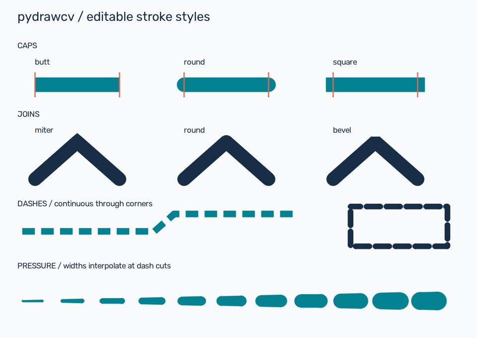

# pydrawcv

An editable, retained-mode 2D drawing library built on NumPy and OpenCV.
Create illustrations, procedural graphics, diagrams, freehand strokes, and animation
as scene objects; render pixels whenever you need them.

**Install `pydrawcv`; import `drawcv`.** Requires Python 3.12 or newer.

```bash
pip install pydrawcv
```

For this checkout, including the milestone 1 stroke improvements:

```bash
pip install -e ".[dev]"
python -m pytest -q
```

## Draw and export an image

```python
from drawcv import (
    Scene, OpenCVRenderer, Line, Circle, Point, Color,
    StrokeStyle, FillStyle, CapStyle,
)

scene = Scene(640, 360, background=Color.white())
node = Circle(center=Point(100, 180), radius=35,
              fill=FillStyle(color=Color(50, 140, 200)))
connection = Line(
    start=Point(150, 180), end=Point(560, 180),
    stroke=StrokeStyle(color=Color(30, 60, 90), width=8,
                       cap_style=CapStyle.BUTT, dash_array=(20, 12)),
)
scene.add(node)
scene.add(connection)
renderer = OpenCVRenderer()
renderer.render(scene).save("diagram.png")
```

The scene remains editable after export. `Canvas.buffer` is a uint8 BGR array;
`Canvas.to_numpy()` returns a copy. For transparent PNG output, set a transparent
scene background and explicitly request BGRA:

```python
scene.background = Color(0, 0, 0, 0)
transparent = renderer.render(scene, alpha=True)
transparent.save("diagram-transparent.png")
transparent.flatten(Color.white()).save("diagram-white.jpg")
```

See [transparent output and alpha semantics](docs/transparency.md).

## Edit, undo, and save the scene

```python
with scene.edit(connection, name="Restyle connection"):
    connection.stroke.width = 12
    connection.stroke.dash_offset = 8

scene.undo()
scene.redo()
assert scene.get(connection.id) is connection

scene.save_json("diagram.drawcv.json")
loaded = Scene.load_json("diagram.drawcv.json")
renderer.render(loaded).save("diagram-loaded.png")
```

Style and transform assignments reject invalid values without corrupting existing
state. Use `scene.edit` for compound changes and geometry edits, and `scene.batch`
for multiple recorded commands. See [reliable edits](docs/reliability.md) for
rollback guarantees and the limits of raw attribute/list mutation.

New scenes use schema **1.4**, including embedded font assets, gradient paints and stroke semantics.
Schemas 1.0 through 1.3 load with compatible defaults. Older readers reject 1.4;
update readers before sharing new documents with them.

## Organize and position objects

Use `Group(children=[...])` for transform hierarchies and `scene.create_layer(name)`
plus `scene.add(obj, layer=name)` for rendering layers. Use `scene.select([...])`
for collective transforms and `scene.find_by_name/tag/type` for lookup. Objects
have stable IDs, visibility, opacity, z-order, tags, and metadata.

```python
from drawcv import place_right_of

with scene.edit(connection):
    place_right_of(connection, node, gap=20, align="center")
```

Coordinates start at the top left; x increases rightward, y downward, and positive
rotation is clockwise. Local geometry maps through object and ancestor transforms.
Stroke widths and dashes remain in **screen pixels** under scaling and shear.
Colors are authored as **RGB** integers 0–255 with alpha 0–1; OpenCV buffers use BGR.
Alpha compositing uses source-over with premultiplied internal surfaces for isolation.

## Animate a drawing

```python
from drawcv import Timing

connection.timing = Timing(duration=2)
scene.animate(connection, "stroke.dash_offset", 0, 32, duration=2)
scene.render_at_time(0.75).save("frame.png")
```

`render_at_time` restores authored state and does not add history entries.
`scene.sample(t)` deliberately updates the live model. `VideoRenderer` provides
frame iteration, image-sequence export, and video export through OpenCV codecs.
Line, Polyline, Arrow, BezierCurve, Path, FreehandStroke, and Arc support progressive
reveal. See [stroke/progress semantics](docs/strokes.md) for closure, transforms,
phase anchoring, and the different progress parameterizations.

## Examples and reference



Run examples as modules from the repository root:

```bash
python -m examples.stroke_styles
python -m examples.progressive_drawing
python -m examples.transparent_output
```

- [Stroke comparison source](examples/stroke_styles.py) and [editable scene](examples/output/stroke_styles.json).
- [Transparent PNG example](examples/transparent_output.py) and [external-composition preview](examples/output/transparent_output_preview.png).
- [Gradient paints and coordinate contracts](docs/gradients.md); [runnable gallery](examples/gradient_fills.py).
- [Alpha API and compositing conventions](docs/transparency.md).
- [StrokeStyle API and conventions](docs/strokes.md).
- [Public API guide](docs/api.md).
- [Retained font typography: installation, metrics and layout](docs/typography.md).
- [Typography backend evaluation](docs/typography-evaluation.md).
- [Reliability and history](docs/reliability.md).
- [Prioritized roadmap and verified findings](docs/roadmap.md).
- Existing runnable examples: [retained editing](examples/phase1_retained_mode.py),
  [groups/selection](examples/phase4_demo.py), [freehand](examples/phase5_demo.py),
  [compositing](examples/phase6_demo.py), [persistence/history](examples/phase7_demo.py),
  and [animation](examples/phase8_demo.py).

## Capabilities and current limits

| Area | Available | Limits / next work |
| --- | --- | --- |
| Geometry | Lines, polygons, circles/ellipses, arcs, rectangles, arrows, quadratic/cubic curves, compound paths | Curves rasterize as approximations |
| Strokes | Butt/round/square caps, round/bevel/miter joins, miter limits, dashed and variable-width outlines | Screen-space widths; arrowhead outlines stay solid |
| Paint | Solid, linear and radial fills; object/world coordinates; RGBA stops; fill rules | Gradient strokes, patterns, and configurable blend modes remain future work |
| Freehand | Raw editable samples; pressure/velocity widths; simplification, smoothing, interpolation | No textured brush system |
| Scene | Groups, layers, lookup, selection, relative positioning, affine transforms | Bounds may be conservative; hit testing is geometric and can select dash gaps |
| Compositing | Opt-in straight BGRA/PNG output; premultiplied images, masks, blur, shadows, isolated opacity | Scenes without gradients/font text retain legacy BGR; alpha export currently PNG only |
| Typography | Hershey compatibility; optional TTF/OTF, Latin/Thai/Arabic shaping, ICU bidi, explicit fallback, wrapping and metrics | Other scripts, emoji, advanced format controls and glyph strokes remain unsupported |
| Persistence | JSON 1.4; forward migration; cloning; undo/redo | Direct edits require transaction discipline; older readers need updating |
| Animation | Timing, easing, numeric/value tracks, progressive drawing, video | No built-in enum/dash-array interpolation; codec availability varies |
| Interchange | Raster images, editable JSON, video | No native SVG/PDF export |
| Performance | Functional full-scene rendering | Full-canvas intermediates; representative benchmarks still needed |

Raster boundary pixels can differ from earlier releases because caps/joins now
have real geometry. These improvements are local source changes; no package has
been published by this task.
